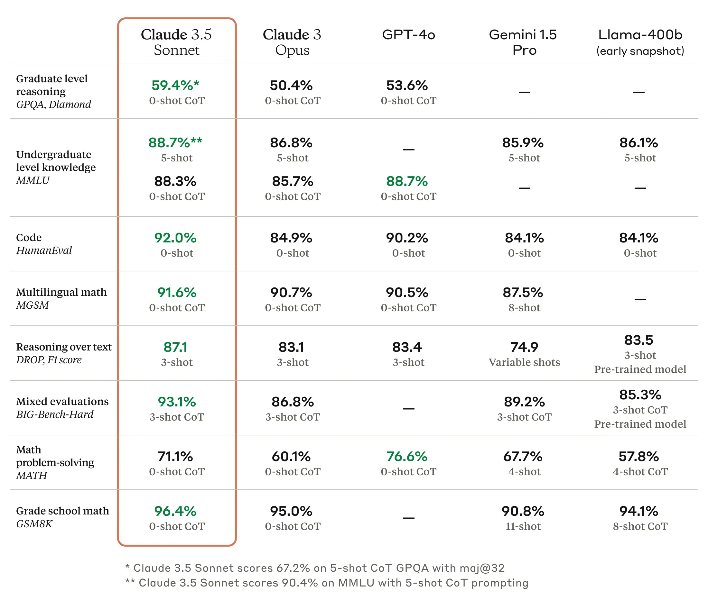

## ChatGPT Powered Assitant Guide

### Model
Claude 3.5 Sonnet 

### Parameters
175 billion

### Why this Model
> [Claude 3.5 Sonnet](https://www.anthropic.com/news/claude-3-5-sonnet) raises the industry bar for intelligence, outperforming competitor models and Claude 3 Opus on a wide range of evaluations, with the speed and cost of our mid-tier model, Claude 3 Sonnet.

> The model costs $3 per million input tokens and $15 per million output tokens, with a 200K token context window.

> We will iteratively testing different models as we got accessibility to paid ones.

Below image is from official anthropic documentation,

## Prompting Guides
https://www.chatgptguide.ai/2024/06/30/the-only-claude-sonnet-3-5-prompt-engineering-guide-youll-need/