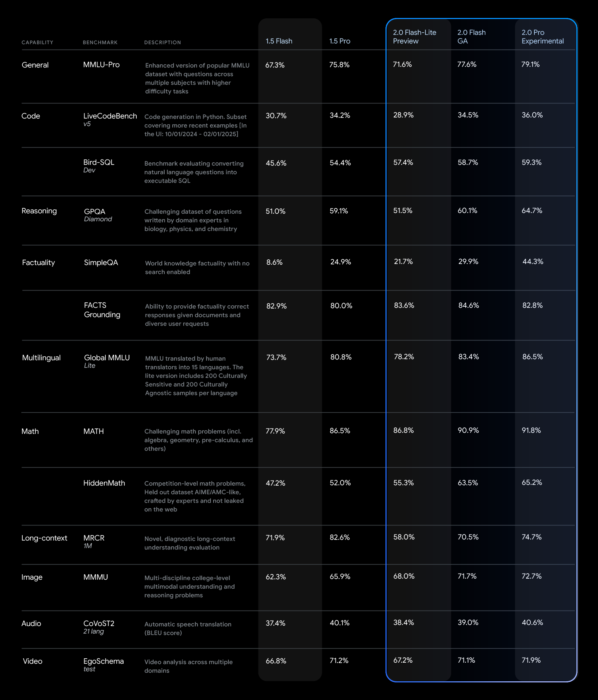

## Google Gemini Powered Assitant Guide

### Model
Gemini 2.0 Flash

### Parameters
Not Disclosed

### Why this Model
> [Gemini 2.0 Flash](https://developers.googleblog.com/en/gemini-2-family-expands/) offers a comprehensive suite of features, including native tool use, a 1 million token context window, and multimodal input. 

> It currently supports text output, with image and audio output capabilities and the Multimodal Live API planned for general availability in the coming months.

> We will iteratively testing different models as we got accessibility to paid ones.

Below image is from official Google Gemini 2.0 Flash documentation,

