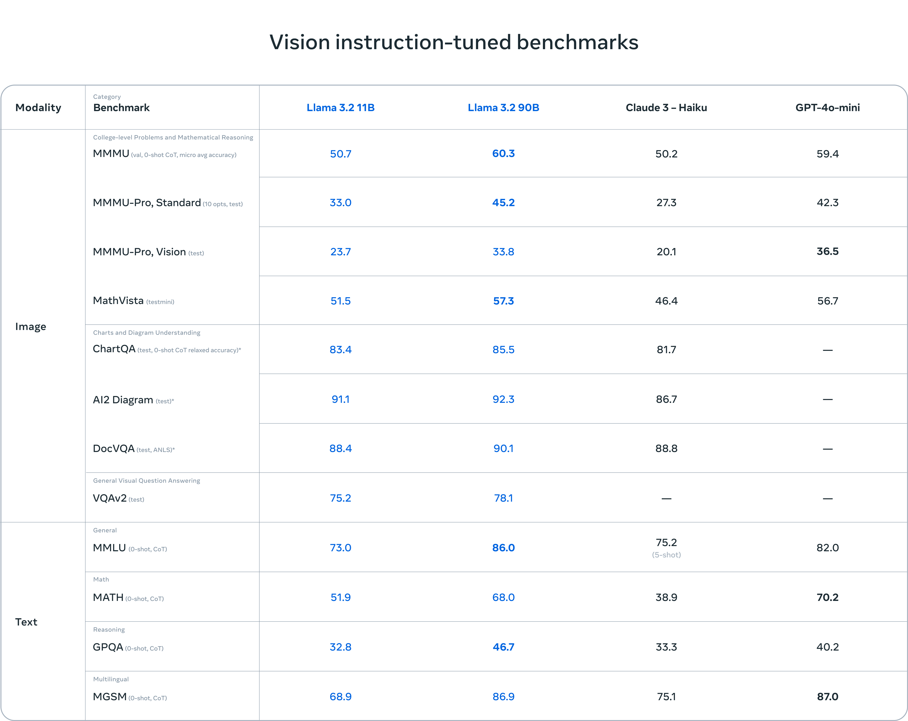

## Meta AI Powered Assitant Guide

### Model
Llama 3.3

### Parameters
70 Billion

### Why this Model
> [Meta Llama 3.3](https://ai.meta.com/blog/llama-3-2-connect-2024-vision-edge-mobile-devices/) 2, which includes small and medium-sized vision LLMs (11B and 90B), and lightweight, text-only models (1B and 3B) that fit onto edge and mobile devices, including pre-trained and instruction-tuned versions.

> The Llama 3.3 1B and 3B models support context length of 128K tokens and are state-of-the-art in their class for on-device use cases like summarization, instruction following, and rewriting tasks running locally at the edge. 

> We will iteratively testing different models as we got accessibility to paid ones.

Below image is from official Meta Llama 3.3 documentation,

